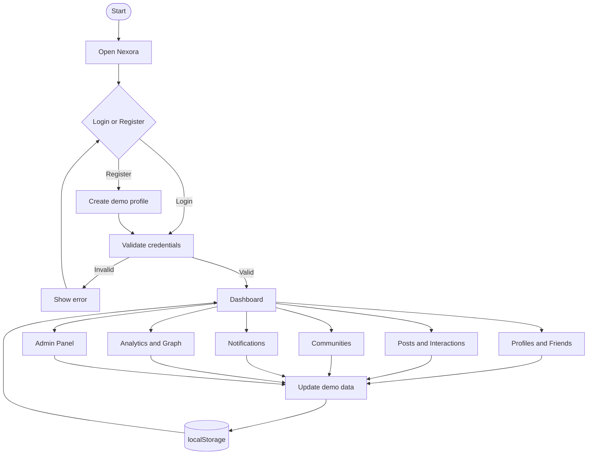

# Nexora - Application Flowchart

```mermaid
flowchart TD
    A([Start]) --> B[Open Nexora]
    B --> C{Login or Register}
    C -->|Login| D[Validate credentials]
    C -->|Register| E[Create demo profile]
    E --> D
    D -->|Invalid| F[Show error]
    F --> C
    D -->|Valid| G[Dashboard]
    G --> H[Profiles and Friends]
    G --> I[Posts and Interactions]
    G --> J[Communities]
    G --> K[Notifications]
    G --> L[Analytics and Graph]
    G --> M[Admin Panel]
    H --> N[Update demo data]
    I --> N
    J --> N
    K --> N
    L --> N
    M --> N
    N --> O[(localStorage)]
    O --> G
```
